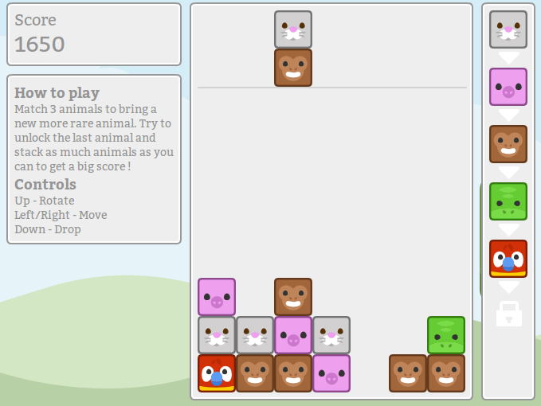

# Zookeeper

Zookeeper is a little game made using Typescript for development, and the excellent [Kenney's assets](http://kenney.nl/).
A demo is available [here](http://zoo.longwelwind.net/).



## Install
Simply clone the project, run this to download the necessary dependencies:
```
npm install
```
And then this to compile the typescript files:
```
tsc
```

Open a browser and go to the location of the git repository to play the game. Have fun !
